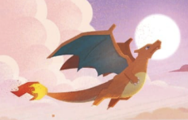
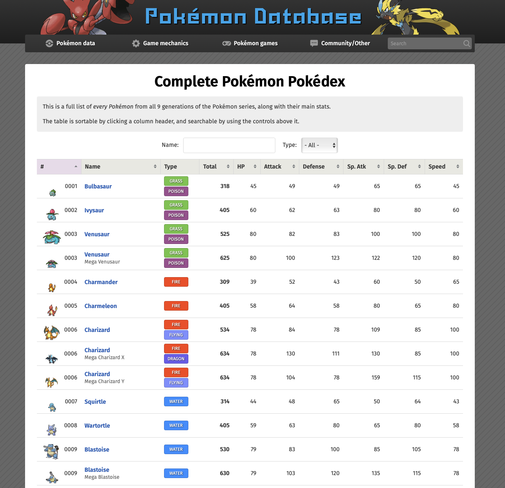
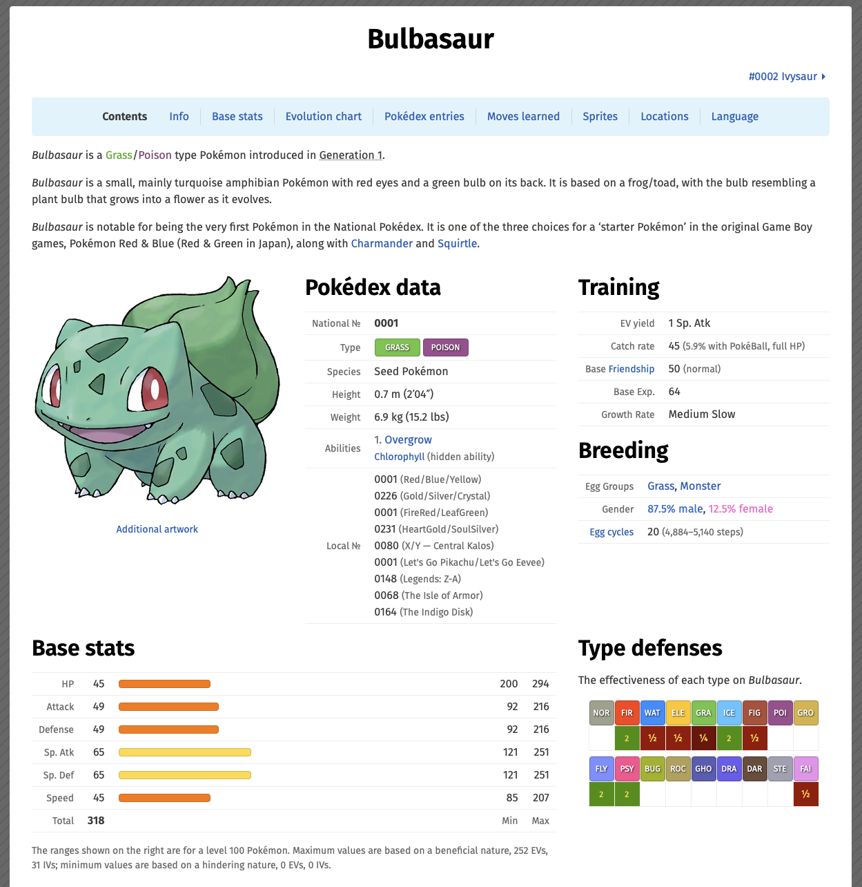

```{r libraries, echo=FALSE, message=FALSE}
library(tidyverse)
library(plotly)
library(Rtsne)
```

```{r setup, include=FALSE}
knitr::opts_chunk$set(echo = FALSE, warning = FALSE, message = FALSE, fig.width = 12, fig.height = 8)
```

# Pokemon Clustering Analysis

One pokemon is a dragon, and another is a motorcycle; one pokemon is a radio, and another is a rock (see Figure 1). There are hundreds of pokemon, and while we can characterize families of pokemon by species, element type, and more, maybe we can characterize them jointly across all these features. This is exactly what this analysis accomplishes!

This report discovers a new way to characterize pokemon based on their base stats, pokedex descriptions, and official illustrations.


```{r fig.width=8, fig.height=5, fig.cap="Charizard, a dragon pokemon (left). Cyclizar, a motorcycle pokemon (right)", fig.show='hold', out.width='49%', fig.align='center'}


```

## Data Collection and Cleaning

All data are pulled from "https://pokemondb.net/pokedex/all" (see Figure 2). Only standard variations of pokemon are scraped for simplicity. For example, Mega Charizard is excluded and we only include the standard "Charizard" variant. In our final analysis we successfully scrape data on 985 pokemon.

```{r fig.width=8, fig.height=5, fig.cap="Charizard, a dragon pokemon (left). Cyclizar, a motorcycle pokemon (right)", fig.show='hold', out.width='49%', fig.align='center'}

```

For each of these pokemon on the database master list, we follow each link and pull three categories of data: pokemon stats (base defense and attack stats; their weight, height; species type; elemental defense and offense); text descriptions from various pokemon games; image data corresponding to the official pokemon illustration given at a fixed angle and posed. Figure 3 shows what the each page looks like for a given pokemon, in this case Bulbasaur.

```{r fig.width=8, fig.height=5, fig.cap="All the data of a single pokemon contained on this page. The text data is scraped from the beginning part of each webpage. Image data is obviously collected for the corresponding image as shown. All other pokemon stats are collected under type defenses, base stats, and breeding (training is not included for simplicity).", fig.show='hold', out.width='49%', fig.align='center'}

```

In the next three subsections, we provide a high-level overview of the data cleaning process for each of the three categories of data.

### Pokemon Stats

Pokemon stats data includes base statistics (HP, Attack, Defense, Special Attack, Special Defense, Speed), types (Fire, Water, Grass, etc.), abilities, egg groups, gender ratios, and physical attributes like height and weight. This categorical and numerical data is one-hot encoded to create binary features for each category. For example, a Fire/Flying type Pokemon like Charizard gets indicator variables for both `Type_Fire` and `Type_Flying`. Similarly, abilities and egg groups are expanded into binary features. Physical measurements (height and weight) are extracted from their text representations and converted to numeric values. This preprocessing results in approximately 37 clean numerical features that capture a Pokemon's battle capabilities and biological characteristics.

### Text Descriptions

Text descriptions from Pokedex entries provide rich semantic information about each Pokemon's characteristics, behavior, and lore across different games. To compress this high-dimensional text data into a usable numeric representation, we apply **Singular Value Decomposition (SVD)** after creating a TF-IDF (Term Frequency-Inverse Document Frequency) matrix.

**Why SVD for text?** SVD is ideal for text data because it identifies latent semantic topics in the corpus. The TF-IDF matrix captures which words are important for each Pokemon, but the raw vocabulary space is extremely sparse (thousands of unique words). SVD decomposes this matrix into orthogonal components that represent underlying "themes" in the text data—such as descriptions of legendary Pokemon, aquatic Pokemon, or evolutionary characteristics. By keeping only the top singular vectors, we retain the most important semantic information while dramatically reducing dimensionality. This creates a dense, low-dimensional representation where Pokemon with similar descriptions cluster together in semantic space.

### Official Illustrations

Pokemon sprite images provide visual information about appearance, color, shape, and design patterns. Each image is flattened into a high-dimensional pixel vector, but this raw representation is inefficient and noisy. We apply **Principal Component Analysis (PCA)** to compress the image data.

**Why PCA for images?** PCA is well-suited for image data because it identifies the directions of maximum variance in pixel space. The first few principal components capture the most important visual variations—such as overall shape, dominant colors, and size—while filtering out noise and redundant information from correlated pixels. Unlike SVD which finds semantic topics, PCA finds geometric patterns in the visual space. The result is a compact representation where Pokemon with similar appearances (e.g., all bird-like Pokemon or all serpentine Pokemon) have similar PCA coordinates. This dimensionality reduction makes subsequent distance calculations computationally tractable while preserving the essential visual features that distinguish Pokemon.

### Final Clean Data

Combining all types of features together, inner joining on all the pokemon names, we have 948 pokemon and 2731 features (including pokemon name).

```{r tsne-full-plot, fig.width=7, fig.height=4}
knitr::include_graphics("data_cleaning/clean_data/tsne_clean_data.png")
```


## Spectral Embedding Analysis

With 2,730 heterogeneous features combining stats, text embeddings, and image components, we need a sophisticated approach to measure Pokemon similarity. We employ spectral clustering, which discovers clusters by analyzing the eigenvectors of a graph Laplacian derived from pairwise similarities.

### Distance Metric: Mahalanobis Distance with Shrinkage Covariance

Rather than using standard Euclidean distance, we compute **Mahalanobis distance** with shrinkage covariance estimation. This is crucial when combining features with vastly different scales and correlations.

**What is Mahalanobis distance?** Unlike Euclidean distance which treats all features equally, Mahalanobis distance accounts for the covariance structure of the data—it "stretches" space along directions of low variance and "shrinks" it along high variance directions. This prevents features with large numeric ranges (like some image PCA components) from dominating the distance calculation over categorical features (like type indicators). The formula is: d(x,y) = √[(x-y)ᵀ Σ⁻¹ (x-y)] where Σ⁻¹ is the inverse covariance matrix.

**Why shrinkage?** With p=2,730 features and n=948 samples, we face a critical challenge: the sample covariance matrix is ill-conditioned and not full rank (you need at least as many samples as features for a well-conditioned covariance matrix). Computing the inverse of such a matrix is numerically unstable and can lead to wildly inaccurate distance estimates.

**How shrinkage helps:** The **Ledoit-Wolf shrinkage estimator** (via `corpcor::invcov.shrink`) regularizes the covariance matrix by blending it with a diagonal target matrix. Specifically, it computes: Σ_shrunk = (1-λ)Σ_sample + λI, where λ is the shrinkage intensity (automatically tuned) and I is the identity matrix. This ensures the inverse exists and is stable, while still preserving the essential correlation structure in the data. The shrinkage "pulls" the covariance matrix toward a diagonal form just enough to make inversion reliable without losing too much information about feature relationships.

### Kernel Selection: Radial Basis Function (RBF)

The Mahalanobis distance matrix is transformed into an affinity (similarity) matrix using the **RBF (Gaussian) kernel**: affinity = exp(-distance² / 2σ²). This kernel has several advantages:

- **Smooth transitions**: The exponential function creates smooth, continuous similarities rather than hard cutoffs
- **Local emphasis**: Nearby Pokemon have high affinity; distant Pokemon have near-zero affinity
- **Graph structure**: The resulting affinity matrix forms a weighted graph where edges represent Pokemon similarities

### Choosing Sigma (σ)

The bandwidth parameter σ controls how rapidly affinity decays with distance. Too small, and the graph becomes disconnected; too large, and all Pokemon appear equally similar. We chose **σ = 0.5 × median Mahalanobis distance** because this value produces the **widest width and range in the affinity distribution** (see right panel below). This maximizes the discriminative power of the affinity matrix—we get a rich spectrum of similarities from near-zero (very different Pokemon) to near-one (very similar Pokemon), rather than all affinities clustering around the same value. The distribution plots below show how our choice of σ creates well-separated affinity values that effectively distinguish different levels of Pokemon similarity.

```{r embedding-family, fig.width=4, fig.height=5, fig.cap="", fig.show='hold', out.width='49%', fig.align='center'}
knitr::include_graphics("data_clustering/clustering_results/distance_distribution.png")
knitr::include_graphics("data_clustering/clustering_results/affinity_distributions.png")
```

### Graph Laplacian and Spectral Embedding

From the affinity matrix, we construct the **normalized graph Laplacian** and compute its eigenvectors. But how many eigenvectors should we use for the embedding? This is determined via **spectral gap analysis**.

**The Spectral Gap Method:**

The eigenvalues of the graph Laplacian encode information about cluster structure. Small eigenvalues (near zero) correspond to eigenvectors that reveal cluster boundaries, while larger eigenvalues correspond to noise or within-cluster variation. The key insight: there is often a large "gap" in the eigenvalue spectrum marking the transition from cluster-informative eigenvectors to noise.

We analyze this by:

1. **Computing all eigenvalues** of the normalized Laplacian (in ascending order, excluding the trivial λ≈0)
2. **Finding gaps**: Compute Δλᵢ = λᵢ₊₁ - λᵢ for consecutive eigenvalues
3. **Selecting dimensionality**: Choose the position of the largest gap as the embedding dimension

**Why this works:** The spectral gap represents a phase transition in the graph structure. Eigenvectors before the gap capture meaningful cluster separations; eigenvectors after the gap represent high-frequency noise. By cutting at the largest gap, we automatically determine the "intrinsic dimensionality" of the cluster structure.

**Alternative criteria we also compute:**

- **Variance threshold**: Use enough eigenvectors to capture 95% or 99% of total variance (similar to PCA)
- **k + log(k) heuristic**: A common rule-of-thumb suggesting using slightly more eigenvectors than clusters
- **Maximum gap**: Our chosen method, which is data-driven and requires no hyperparameter tuning

The spectral gap method is optimal because it adapts to the actual cluster structure in your data rather than imposing an arbitrary cutoff. The selected eigenvectors "unfold" the nonlinear manifold into a space where Euclidean distance (used by k-means) becomes meaningful.

## Cluster Count Analysis

Determining the optimal number of clusters is a critical decision in unsupervised learning. We evaluate four standard methods to assess different values of k (number of clusters) and observe striking differences in their recommendations.

### Elbow Method and Gap Statistic

<div style="display: flex; justify-content: space-around;">
```{r elbow-plot, echo=FALSE, out.width='48%'}
knitr::include_graphics("data_clustering/clustering_results/elbow_method_plot.png")
```
```{r gap-plot, echo=FALSE, out.width='48%'}
knitr::include_graphics("data_clustering/clustering_results/gap_statistic_plot.png")
```
</div>

**Elbow Method** plots the within-cluster sum of squares (WCSS) as a function of k. The idea is to find the "elbow" where adding more clusters provides diminishing returns. However, for our Pokemon data, the curve decreases smoothly without a clear elbow—the reduction in WCSS is nearly linear from k=2 to k=20, making it difficult to identify a single optimal value. This suggests that our spectral embedding is relatively uniform without obvious natural breakpoints.

**Gap Statistic** compares the WCSS of our clustering to that of random data. It suggests k=5 as optimal (where the gap is maximized), but this seems too coarse given the diversity of Pokemon. The gap statistic can be overly conservative when data has complex manifold structure, as it assumes clusters are well-separated and roughly spherical. Our spectral embedding captures more nuanced similarity relationships that don't fit these assumptions.

**Why these methods were not useful:** Both the elbow method and gap statistic failed to provide actionable guidance. The elbow method showed no clear inflection point, and the gap statistic suggested k=5, which would group very disparate Pokemon together (e.g., lumping legendary dragons with tiny bug Pokemon). These methods are better suited for data with clear, well-separated clusters rather than the continuous manifold structure we observe in Pokemon feature space.

### Calinski-Harabasz Index and Silhouette Analysis

<div style="display: flex; justify-content: space-around;">
```{r good-elbow-1, echo=FALSE, out.width='48%'}
knitr::include_graphics("data_clustering/clustering_results/calinski_harabasz_plot.png")
```
```{r good-elbow-2, echo=FALSE, out.width='48%'}
knitr::include_graphics("data_clustering/clustering_results/silhouette_plot.png")
```
</div>

**Calinski-Harabasz Index** measures the ratio of between-cluster variance to within-cluster variance. Higher values indicate better-defined clusters. The plot shows a clear peak at **k=18**, indicating this value maximizes cluster separation while maintaining internal cohesion.

**Silhouette Analysis** measures how similar each Pokemon is to its own cluster compared to other clusters. Values range from -1 (misclassified) to +1 (well-clustered). While the maximum average silhouette occurs at k=2 (a trivial split between "normal" and "outlier" Pokemon), we observe a secondary local maximum around **k=18** (marked with the dashed line). This agreement between two independent metrics provides strong evidence for k=18.

**Choosing k=18:** The convergence of Calinski-Harabasz (which peaked at k=18) and Silhouette analysis (which showed stability at k=18) gives us confidence in this choice. With 18 clusters and 948 Pokemon, we achieve an average cluster size of ~53 Pokemon—large enough to capture meaningful patterns but small enough to maintain within-cluster similarity. This granularity aligns with domain knowledge: Pokemon naturally fall into numerous archetypal groups (aquatic, avian, legendary, dragon-like, humanoid, etc.), and k=18 provides sufficient resolution to distinguish these patterns without over-fragmenting the data.

## Final Clusters

The interactive 3D plot below shows the final clustering results, providing an intuitive visualization of how Pokemon group together based on their combined features.

```{r bad-elbows, echo=FALSE, results='show', message=FALSE, fig.height=6, fig.width=8.5, warning=FALSE, fig.align="center"}
source("data_modeling/tsne_visualization.R")
p
```

### Understanding the 3D Visualization

This **interactive 3D plot** uses **t-SNE (t-Distributed Stochastic Neighbor Embedding)** to project the **21-dimensional spectral embedding** into 3D space for visualization. Each point represents one Pokemon, colored by its cluster assignment from k-means clustering.

**Why t-SNE for visualization?**

t-SNE excels at revealing cluster structure because it preserves local neighborhood relationships while arranging dissimilar points far apart. Unlike linear methods (PCA), t-SNE is a non-linear dimensionality reduction technique that:

- **Preserves manifold structure**: Pokemon that are close in the 21D spectral space remain close in 3D
- **Emphasizes clusters**: Tight groups in 3D indicate Pokemon with genuinely similar multimodal features
- **Reveals boundaries**: Gaps between clusters show natural divisions in Pokemon characteristics
- **Handles non-linearity**: Captures curved, non-convex cluster shapes that linear projections would miss

**Interactive Features:**

- **Hover over any Pokemon** to see its name, cluster assignment, and the top 10 most important features (by XGBoost gain) that distinguish its cluster from others
- **Rotate the plot** to explore cluster structure from different angles
- **Zoom in/out** to examine specific clusters or view the global structure
- **Click legend items** to highlight or hide specific clusters

**Interpretation:**

- **Proximity**: Pokemon close together share similar stats, Pokedex descriptions, and visual appearance
- **Cluster coherence**: Tight, well-separated clusters (like legendary Pokemon or specific type groups) indicate strong multimodal similarity
- **Overlap regions**: Some Pokemon lie between clusters, reflecting hybrid characteristics (e.g., dual-type Pokemon bridging elemental categories)
- **Feature importance**: The hover text reveals which features (stats, text topics, or visual components) most strongly define each cluster, providing interpretable insights into what makes each group distinct

### Clustering Pipeline Summary

1. **Data Collection**: Web scraping of 985 Pokemon (stats, text, images)
2. **Feature Engineering**: One-hot encoding (stats), SVD (text), PCA (images) → 2,730 features
3. **Distance Computation**: Mahalanobis distance with shrinkage covariance
4. **Affinity Matrix**: RBF kernel with σ = 0.5 × median distance
5. **Spectral Embedding**: 21 eigenvectors selected via spectral gap analysis + k+log(k) heuristic
6. **K-means Clustering**: 18 clusters in 21D spectral space (chosen via Calinski-Harabasz and Silhouette)
7. **Visualization**: t-SNE projection from 21D to 3D for interpretable exploration
8. **Feature Importance**: XGBoost binary classifiers identify defining features per cluster

### Results
- **Total Pokemon**: `r nrow(plot_data)`
- **Number of Clusters**: `r n_distinct(plot_data$cluster)`
- **Between/Total Variance**: 53.35% (k-means on 21D spectral embedding)

## Discussion: Interpreting Clusters Through Feature Importance

Understanding what each cluster represents requires examining the features that most strongly distinguish it from other clusters. XGBoost binary classifiers (each cluster vs. all others) reveal which features have the highest **gain**—a measure of how much a feature improves the model's ability to separate that cluster from the rest. High gain indicates that a feature is both informative and frequently used in decision splits.

We examine the three largest clusters as case studies:

### Cluster 12: Ground/Electric/Fire Types (118 Pokemon)

**Representative Pokemon**: Ampharos, Arcanine, Blaziken, Camerupt, Boltund, Arbok, Bellibolt

**Top Distinguishing Features**:
1. **type_ground** (gain: 0.233) - Strong association with Ground-type weaknesses
2. **pType_Electric** (0.121) - Primary Electric typing
3. **pType_Fire** (0.103) - Primary Fire typing
4. **type_normal** (0.075) - Weakness or resistance to Normal moves
5. **type_poison** (0.057) - Poison-type defensive characteristics

**Interpretation**: This cluster captures Pokemon with strong elemental affinities, particularly Electric and Fire primary types. The high importance of `type_ground` (a defensive stat indicating Ground-type weakness) suggests these Pokemon share common vulnerabilities—Electric types are weak to Ground, and Fire types often appear alongside Ground-type moves in battle contexts. The diversity of primary types (Electric, Fire, Poison) within a single cluster indicates that **defensive type matchups** and **battle role similarity** may be more important than primary typing alone for grouping Pokemon. These are likely offensive-oriented Pokemon that share similar stat distributions (moderate-to-high Attack/Special Attack) and comparable weaknesses.

### Cluster 14: Water-Type Pokemon (104 Pokemon)

**Representative Pokemon**: Blastoise, Alomomola, Barraskewda, Barbaracle, Buizel, Brionne

**Top Distinguishing Features**:
1. **pType_Water** (gain: 0.592) - Overwhelmingly dominant feature
2. **type_grass** (0.086) - Grass-type defensive characteristics (Water is weak to Grass)
3. **type_electricity** (0.039) - Electric-type defensive characteristics (Water is weak to Electric)
4. **weight_kg** (0.014) - Physical size/weight
5. **SVD_61** (0.016), **PC442** (0.014) - Text and visual features

**Interpretation**: This is the most **homogeneous cluster** by type, with Water-type Pokemon forming a natural grouping. The feature importance is dominated by `pType_Water` (59.2% gain), indicating that primary Water typing is the single most important distinguisher. Secondary features like `type_grass` and `type_electricity` reflect shared weaknesses—Water Pokemon universally fear Grass and Electric attacks. Interestingly, `weight_kg` appears as a distinguishing feature, suggesting this cluster may capture aquatic Pokemon with similar body structures (streamlined, medium weight). The presence of text (SVD) and image (PC) features hints that Pokedex descriptions and visual appearance also contribute—likely capturing aquatic/marine themes in both text ("ocean," "water," "swim") and visual design (blues, fins, streamlined shapes).

### Cluster 13: Normal-Type and Support Pokemon (83 Pokemon)

**Representative Pokemon**: Arceus, Blissey, Audino, Bouffalant, Bibarel, Bidoof, Ambipom

**Top Distinguishing Features**:
1. **pType_Normal** (gain: 0.338) - Primary Normal typing
2. **type_ghost** (0.306) - Ghost-type defensive characteristics (Normal is immune to Ghost)
3. **type_bug** (0.112) - Bug-type interactions
4. **eggGroup_Field** (0.063) - Breeding compatibility group
5. **type_ground** (0.032), **type_ice** (0.024) - Various defensive stats

**Interpretation**: This cluster is defined by **Normal-type Pokemon**, but with an interesting twist: the second-most important feature is `type_ghost` (30.6% gain), which represents *immunity* to Ghost-type moves—a defining characteristic of Normal types. The high importance of `eggGroup_Field` suggests this cluster captures Pokemon with similar breeding compatibility, often indicating shared evolutionary origins or ecological niches (Field group includes mammals and land-dwelling creatures). The presence of **Arceus** (the "God" Pokemon) and **Blissey** (the ultimate support/tank) indicates this cluster may represent **versatile, bulky Pokemon** with broad utility rather than specialized offensive roles. The lower importance of individual stat features (like base_defense) compared to type features suggests that these Pokemon are grouped more by their **type identity** and **battle role** than by raw stats.

### Key Insights from Feature Importance

1. **Type dominates clustering**: Primary types (`pType_*`) and defensive type matchups (`type_*`) are consistently the highest-gain features, suggesting that Pokemon's elemental identity is the strongest signal in the multimodal data.

2. **Defensive characteristics matter**: Features like `type_ground`, `type_grass`, and `type_ghost` (representing weaknesses, resistances, or immunities) are often more important than offensive stats, indicating that **how Pokemon defend** is as important as how they attack.

3. **Egg groups reveal ecological similarity**: The appearance of `eggGroup_Field` in Cluster 13 suggests that breeding compatibility (which reflects evolutionary and ecological relationships) contributes to clustering even when not explicitly emphasized in the analysis.

4. **Multimodal features add nuance**: Text features (SVD components) and image features (PC components) appear in the top 10 for Cluster 14, indicating that Pokedex descriptions and visual design provide additional clustering signal beyond pure stats—especially for thematically coherent groups like Water types.

5. **Cluster size correlates with type ubiquity**: The largest clusters (12, 14, 13) correspond to common type combinations (Electric/Fire/Ground, Water, Normal), suggesting that Pokemon design follows archetypal patterns with certain elemental identities being more prevalent.

---

*Report generated on `r Sys.time()`*
